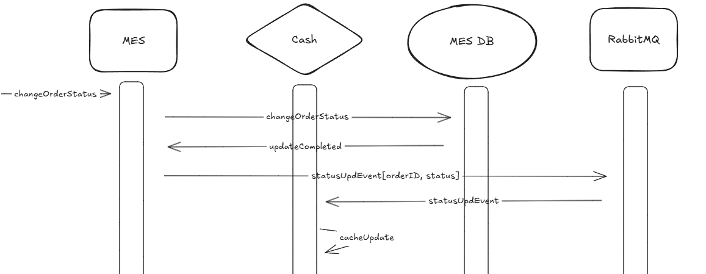

*Предлагаемое решение*

Настройка серверного кэширования данных по заказам в MES. 

В отличие от клиентского, серверное кэширование не требует привязки к конкретному браузеру\устройству и позволяет лучше контролировать кэш (вовремя обновлять).

Рассмотрим два варианта реализации:

1. Используя паттерн Cache-Aside
    + Прост в реализации
    + Хорошая производительность в случае, когда данные меняются реже, чем читаются (наш случай)
    + В случае ошибки работы кэша, данные считаются из БД

 Также, можно облегчить MES API, убрав из него логику вывода списка заказов. 

2. Используя паттерн Event-Driven Caching
    + Высокая производительность
    - Сложно реализовать
    + Наличие событийной инфраструктуры (RabbitMQ) должно существенно облегчить реализацию
    - Ошибки в обработке событий могут привести к несогласованности данных.

Причины, по которым другие паттерны не попали в шорт-лист для реализации:

У Read-Through есть ограничение способов реализации формата данных в кэше (только идентичный БД) и чувствительность к ошибкам кэша;
Refresh-Ahead не позволяет реагировать на изменения в реальном времени, так как обновления выполняются по заранее заданному расписанию (которого у нас нет).

*Стратегия инвалидации*

Консистентность данных нам важнее, чем скорость. Также, в нашем случае затруднительно определить TTL, тк заказы обрабатываются неравномерно по времени.
Поэтому, обновлять кэш будем только после явной валидации ("Validation-Based Caching").

С учетом специфики потребностей операторов, строго определим тип кэшируемых заказов по их статусу:

cacheable (must-revalidate): MANUFACTURING_APPROVED, MANUFACTURING_STARTED, MANUFACTURING_COMPLETED, PACKAGING - сервер добавляет валидирующие заголовки (ETag) к ресурсам;
non-cacheable (no-cache): все остальные статусы, заголовки не добавляются. При смене статуса заказа на один из non-cacheable, тот удаляется из кэша. 

При первом открытии страницы, фильтр по умолчанию у каждого оператора должен выводить список заказов в "кэшируемых" статусах. Эта мера позволит снизить объем запросов на сервер, а также размер используемой кэшем памяти. 

*Мотивация*

Поможет существенно ускорить загрузку рабочей страницы оператора и обеспечить актуальность рабочих данных.