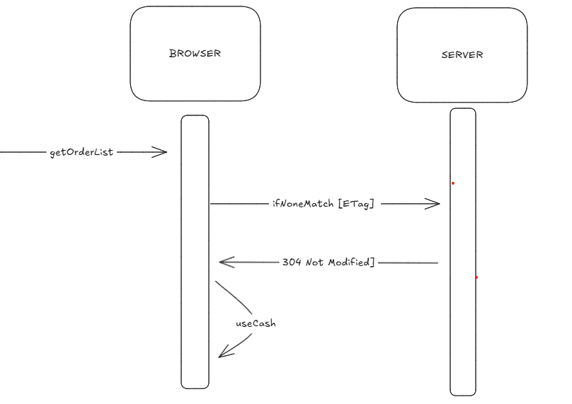
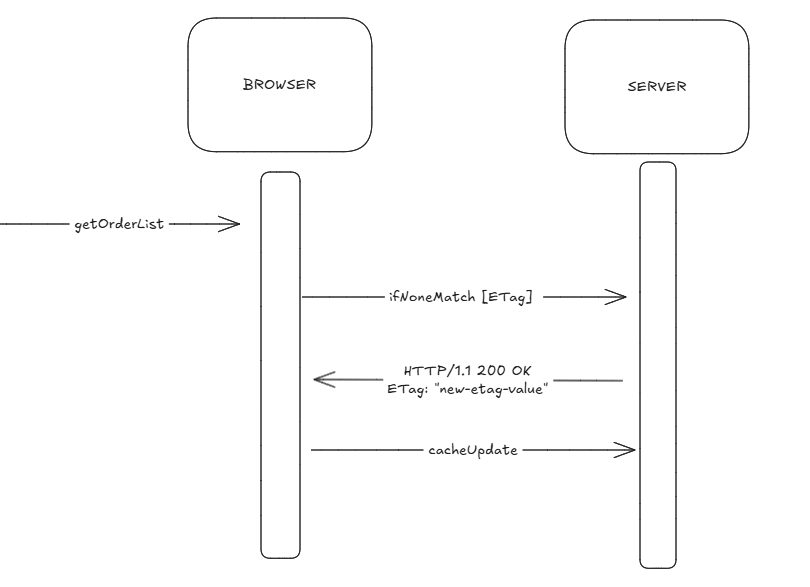

*Предлагаемое решение*

Настройка HTTP-кэширования компонента MES: просто в реализации и не требует установки дополнительных компонентов, что в условиях ограниченных ресурсов и компетенций является большим плюсом. 

Инвалидация кэша путем реализации стратегии "Validation-Based Caching":

Консистентность данных нам важнее, чем скорость. Данный подход гарантирует, что клиент всегда работает с актуальными данными. 
Недостатком является рост нагрузки на сервер.

С учетом специфики потребностей операторов, строго определим тип кэшируемых заказов по их статусу:

cacheable (must-revalidate): MANUFACTURING_APPROVED, MANUFACTURING_STARTED, MANUFACTURING_COMPLETED, PACKAGING - сервер добавляет валидирующие заголовки (ETag) к ресурсам;
non-cacheable (no-cache): все остальные статусы, заголовки не добавляются.

При первом открытии страницы, фильтр по умолчанию у каждого оператора должен выводить список заказов в "кэшируемых" статусах. Эта мера позволит снизить объем запросов на сервер, а также размер используемой кэшем памяти. 

Оптимальный TTL кэша следует определить, учитывая среднюю продолжительность прохождения заказом этапов от MANUFACTURING_APPROVED до PACKAGING. Удалять только заказы в статусе MANUFACTURING_COMPLETED и PACKAGING методом LIFO - т.к. выше шанс того, что данные вскоре поменяются (изменится статус) и будут обновлены в кэше. 

*Мотивация*

Поможет существенно ускорить загрузку рабочей страницы оператора